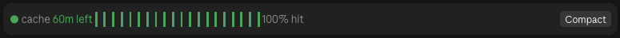

# cache-buster

A Claude Code mod that shows how much time is left on the prompt cache, so you can keep a session going (or compact it) before the cache expires.

Desktop app:



Terminal:


## Why

Claude Code caches your conversation between requests, for an hour or for five minutes depending on your account (see [Which cache length you have](#which-cache-length-you-have)). While the cache is warm, each new message reads the conversation back from the cache at a tenth of the normal input price or less, so it is at least 90% cheaper (95% on Opus 5.5).

If you go longer than that without sending anything, the cache expires. Your next message has to write the whole conversation back into the cache, which costs twice the normal input price on the 1-hour cache. That one message costs about 20 times what it would have with a warm cache (40 times on Opus 5.5), and the more context you have built up, the bigger that bill.

This mod shows how long you have before that happens. If you have a long session going and know you'll be away past the hour, press Compact first. The conversation shrinks to a short summary, so the message that starts it up again is cheap.

Prices are from the [Claude pricing page](https://platform.claude.com/docs/en/about-claude/pricing#prompt-caching), checked 2026-10-02.

## What it shows

The goal is two things: keep the cache from expiring, and keep the hit rate high on each request. Each piece of the row helps with one of them.

### Dot

How close the cache is to expiring.

| Color | Means | What to do |
| --- | --- | --- |
| Green | Plenty of time | Nothing |
| Yellow | Running low (15 minutes left on the 1-hour cache, 2 minutes on the 5-minute cache) | If you're about to step away, decide now whether to compact |
| Red | About to expire (5 minutes left, or 1 minute on the 5-minute cache) | Send a message to keep the cache, or press Compact |

### Time left and bar

How long until the cache expires, counted from the last request Claude Code sent for this conversation. Every request refreshes the cache, so the bar refills to full each time Claude replies. It drains one block every 3 minutes on the 1-hour cache. Remaining blocks take the dot's color, and used blocks turn gray. At zero the label reads `expired`, and your next message pays the full price described in [Why](#why).

Requests made by subagents don't refresh it, since they don't use the main conversation's cache.

### Hit rate

The share of the last request's input that was read from the cache instead of processed fresh. Higher is better: cached input costs a tenth of the normal price or less, while fresh input costs full price, or twice that when it's written into the 1-hour cache.

| Hit rate | Usually means |
| --- | --- |
| 90% to 100% | Normal. Almost the whole conversation came from the cache. |
| Low, right after a new session, `/clear`, or a compact | Expected. Nothing was cached yet, and the next request should be back up near 100%. |
| Near 0% in the middle of a session | The cache was lost. Either it expired, or something invalidated it: switching models, connecting or removing an MCP server, or a Claude Code upgrade. See [Actions that invalidate the cache](https://code.claude.com/docs/en/prompt-caching#actions-that-invalidate-the-cache). |

It only describes the last request. It says nothing about time left; the countdown covers that.

### Compact button

Runs the same thing as `/compact`. It replaces the conversation with a short summary, so the next request only has to cache that summary instead of the whole history. Use it when the dot is yellow or red and you know you'll be away past the cache length. Compacting while the cache is still warm is cheap, because the summarizing request reads the conversation from the cache. Compacting after it expires costs a full uncached read of the history.

The row hides after any compact (the button, `/compact`, or an automatic one) and comes back with the next reply. If Claude is mid-reply, the button can't compact, and a popup says why.

### Warning popup

Appears once when the dot turns red: "Cache expires in ~5m. Compact or send something." (~1m on the 5-minute cache). It shows once per idle stretch and resets with the next request.

## Which cache length you have

From [How Claude Code uses prompt caching](https://code.claude.com/docs/en/prompt-caching#which-ttl-each-request-gets), checked 2026-10-02:

| How you use Claude Code | Main conversation cache |
| --- | --- |
| Claude subscription, within your plan's included usage | 1 hour |
| Claude subscription after you go over your plan's limit and draw on usage credits | 5 minutes |
| API key | 5 minutes |
| Amazon Bedrock, Google Cloud, or Microsoft Foundry | 5 minutes |

You can override the default with the `promptCacheTtl` setting (`"5m"` or `"1h"`) in `~/.claude/settings.json`, or the `CLAUDE_CODE_PROMPT_CACHE_TTL` environment variable. Both need Claude Code v2.1.242 or later. `FORCE_PROMPT_CACHING_5M=1` forces five minutes, and `ENABLE_PROMPT_CACHING_1H=1` asks for an hour.

If you're on the 5-minute cache, set cache-buster's cache length to 5 (see [Notes](#notes)). The mod can't detect which one you have, so it won't notice if a subscription switches to 5 minutes partway through a session because you went over your plan's limit.

To check which one your sessions use, run this and look at `usage.cache_creation`. Tokens under `ephemeral_1h_input_tokens` mean the 1-hour cache, and tokens under `ephemeral_5m_input_tokens` mean the 5-minute cache.

```bash
claude -p "hello" --output-format json
```

## Install

1. Clone the repo into your mods folder:

   ```bash
   git clone git@github.com:dblanken-yale/cache-buster.git ~/.claude/mods/cache-buster
   ```

2. Add the folder to `CLAUDE_CODE_PLUGIN_DIRS` in the `env` block of `~/.claude/settings.json`:

   ```json
   {
     "env": {
       "CLAUDE_CODE_PLUGIN_DIRS": "~/.claude/mods/cache-buster"
     }
   }
   ```

   If the variable already lists other folders, add this one with a `:` between them, for example `"~/.claude/mods/statusline:~/.claude/mods/cache-buster"`.

3. Start a new Claude Code session, in the terminal or the desktop app. The row appears above the prompt after the first reply.

To try it in one terminal session without changing settings:

```bash
claude --plugin-dir ~/.claude/mods/cache-buster
```

## Update

```bash
git -C ~/.claude/mods/cache-buster pull
```

Terminal sessions reload the mod when its files change. Desktop app sessions pick it up when you start a new one.

## Notes

- The mod assumes a 1-hour cache by default. If you're on the 5-minute cache (see [Which cache length you have](#which-cache-length-you-have)), set the cache length to 5 in the plugin's row in the config menu, or in `~/.claude/settings.json`:

  ```json
  { "pluginConfigs": { "cache-buster": { "options": { "cacheMinutes": "5" } } } }
  ```

  The display updates once a minute, so the 5-minute cache is coarse.
- To check it after editing: `claude plugin validate ~/.claude/mods/cache-buster`.
- `tsconfig.json` points at `.claude-plugin/types/`, which Claude Code generates and git ignores, so type-checking a fresh clone needs those files regenerated first.
